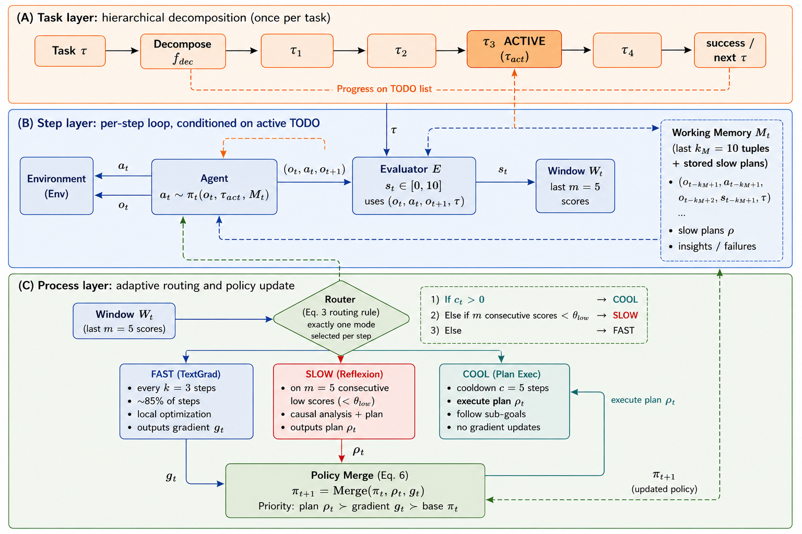
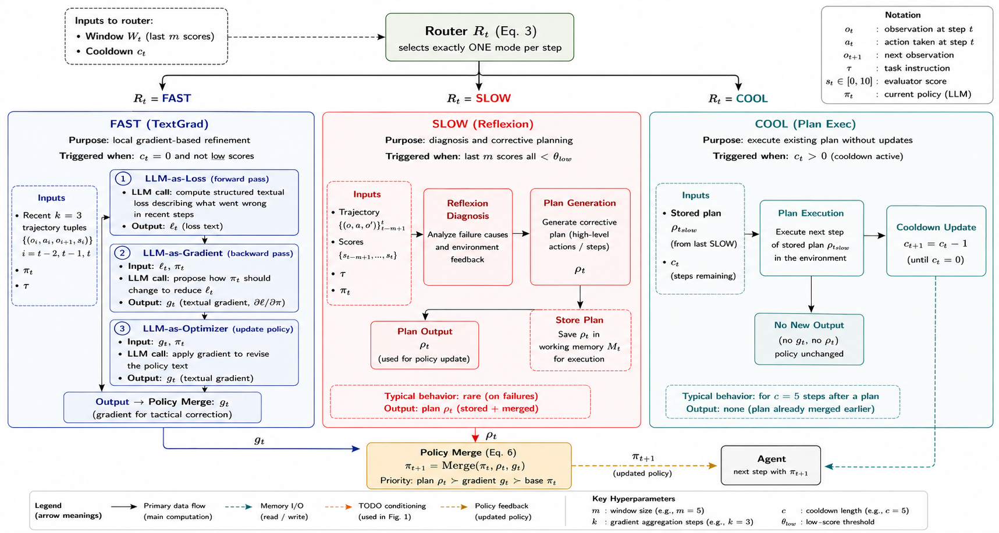
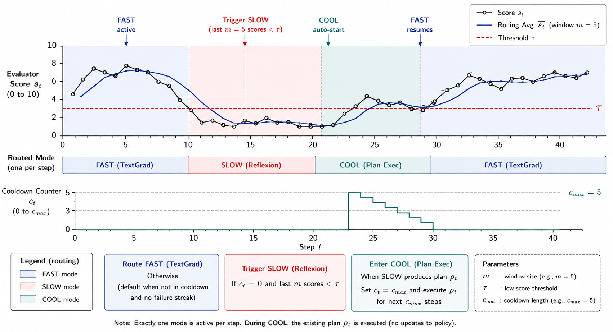
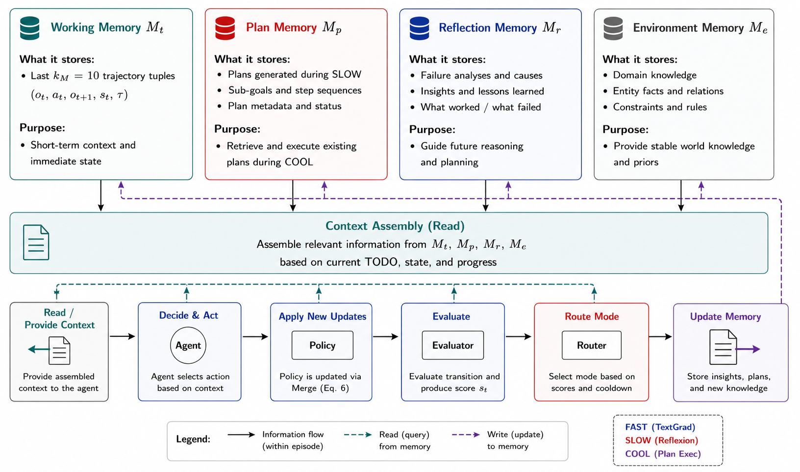

# ReflexGrad: Within-Episode Failure Recovery in LLM Agents via Progress-Gated Dual-Process Routing

[](https://arxiv.org/abs/2511.14584)
[](https://opensource.org/licenses/MIT)
[](https://arxiv.org/abs/2511.14584)

Official implementation of **"ReflexGrad: Within-Episode Failure Recovery in LLM Agents via Progress-Gated Dual-Process Routing"** by Ankush Kadu and Aswanth Krishnan (QpiAI).

Accepted at the **ICML 2026 Workshop on Failure Modes in Agentic AI (FoGen)**.

**Paper:** [arXiv:2511.14584](https://arxiv.org/abs/2511.14584)

---

## Overview

LLM agents fail on tasks they could solve: the agent commits to a wrong approach early, environment feedback is uninformative, minor variations repeat, and the step budget runs out. The information needed to escape already exists in the post-failure trajectory — but existing methods either delay recovery to the next trial (Reflexion) or refine the wrong strategy locally (TextGrad).

**ReflexGrad** closes this gap with a dual-process architecture that escalates from tactical to strategic correction *within a single episode, without demonstrations*:

- **Fast process** — per-step textual refinement every `k=3` steps (TextGrad-style), catching errors a single gradient can fix.
- **Slow process** — stall-triggered causal replanning when `m=5` consecutive low-progress scores fire the routing gate (Reflexion-style).
- **Progress-gated router** — a deterministic rule over a rolling window of evaluator scores selects exactly one process per step.
- **Priority merge** — `plan ≻ gradient ≻ base policy`, keeping the natural-language policy coherent without averaging contradictory updates.
- **Cooldown** — protects plan execution from premature gradient interference.

## Key Results

On **ALFWorld** (134 tasks, n=10 seeds, **no demonstrations**):

| Model | Zero-shot | ReflexGrad | Gain |
|-------|-----------|------------|------|
| GPT-5 | 46.3% | **88.1% ± 2.0** | +41.8 pp |
| Qwen-3-8B (open-weight) | 35.1% | **75.4% ± 2.2** | +40.3 pp |

- Compute-matched on Qwen-3-8B, demo-free ReflexGrad **beats 1-shot LATS (+2.7pp), Tree of Thoughts (+5.7pp), and Self-Refine (+6.7pp)**, all at *p* < 0.05.
- The 1.5pp cross-model gain difference is within seed noise (*p* ≈ 0.13), indicating the lift is architectural rather than model-dependent.

## Architecture



*The agent acts on the environment; an evaluator E scores each transition and scores accumulate in a rolling window. The router selects FAST (local refinement, ~85% of steps), SLOW (causal reasoning on consecutive low scores), or COOL (plan execution under cooldown). Each slow activation emits three observable artifacts: a reproducible trigger, a causal diagnostic, and a verified fix.*



*FAST process (TextGrad-style four-stage local optimization) and SLOW process (Reflexion-style four-stage causal reasoning), feeding the priority merge.*



*Routing over time: per-step evaluator score (top), router decision FAST/SLOW/COOL (middle), and the rolling window / cooldown counter (bottom). High stable scores → FAST; sustained low scores → SLOW; after a slow activation → COOL for c steps.*



*The within-episode memory subsystem: working memory, plan memory, gradient archive, failure memory, and environment knowledge, composed per step for the agent and the slow process. Memory is a supporting subsystem; the main contribution is the routing rule.*

## Installation

### Option 1 — Local setup

```bash
git clone https://github.com/qpiai/reflexgrad.git
cd reflexgrad

conda create -n reflexgrad python=3.10
conda activate reflexgrad

pip install -r requirements.txt

# Download ALFWorld data
alfworld-download
export ALFWORLD_DATA=/path/to/alfworld/data
```

### Option 2 — Docker

```bash
docker build -t reflexgrad .
docker run -it --env OPENAI_API_KEY=your_key reflexgrad
```

## Model Providers

ReflexGrad is model-agnostic. Select the backend with `--model_provider`:

| Provider | Flag | Env vars |
|----------|------|----------|
| OpenAI (GPT-5) | `--model_provider openai` | `OPENAI_API_KEY` |
| OpenRouter (Qwen-3-8B, etc.) | `--model_provider openrouter` | `OPENROUTER_API_KEY`, `OPENROUTER_MODEL` |
| Google Gemini | `--model_provider gemini` | `GEMINI_API_KEY` |
| vLLM (local) | `--model_provider vllm` | — |

Example (open-weight, reproduces the Qwen-3-8B results):

```bash
export OPENROUTER_API_KEY=your_key
export OPENROUTER_MODEL=qwen/qwen3-8b
export OPENROUTER_FAST_MODEL=qwen/qwen3-8b
```

## Quick Start

```bash
# Single environment (smoke test)
python main.py --model_provider openrouter --num_trials 1 --num_envs 1 --run_name test_run --env_type alfworld

# Full ALFWorld benchmark (134 tasks)
python main.py --model_provider openrouter --num_trials 1 --num_envs 134 --run_name alfworld_full --env_type alfworld
```

## Reproducing Paper Results

```bash
# Qwen-3-8B, 134 tasks, headline 75.4% (set OPENROUTER_MODEL=qwen/qwen3-8b)
python main.py --model_provider openrouter --num_trials 1 --num_envs 134 \
  --run_name paper_qwen --env_type alfworld

# GPT-5, 134 tasks, headline 88.1%
python main.py --model_provider openai --num_trials 1 --num_envs 134 \
  --run_name paper_gpt5 --env_type alfworld
```

The released `n=10` seed list `{42, 123, 456, 789, 1024, 1337, 2025, 3141, 5926, 7531}` and per-seed logs reproduce the reported means. See [REPRODUCE.md](REPRODUCE.md) for full details.

## Configuration

Key hyperparameters (`base_config.yaml` / CLI):

| Parameter | Value | Description |
|-----------|-------|-------------|
| `max_steps` | 15 | Episode budget for headline results (55 used only for failure analysis) |
| `k` (gradient cadence) | 3 | Fast process fires every k steps |
| `m` (slow trigger) | 5 | Slow process fires on m consecutive low scores |
| `θ_low` (low-progress threshold) | 4 | Score below this counts as low |
| `c` (cooldown) | 5 | Steps protected for plan execution |
| `k_M` (working memory) | 10 | Trajectory tuples kept in context |

## Repository Structure

```
reflexgrad/
├── main.py                       # Entry point (--env_type, --model_provider)
├── reflexgrad_trial.py           # Core trial engine: routing, FAST/SLOW, merge
├── reflexgrad_core_v12.py        # ReflexGradCore: dual-process router
├── reflexgrad_learning_engine.py # FailureMemory, PolicyGradientStore, LearningContext
├── dynamic_prompting.py          # TextGrad prompt optimization
├── generate_reflections.py       # Reflexion memory updates
├── universal_env_wrapper.py      # Env abstraction (ALFWorld, TextWorld, ...)
├── task_todo_manager.py          # Hierarchical TODO decomposition
├── task_classifier.py            # Task-type classification
├── knowledge_classifier.py       # Knowledge transfer
├── learning_extractor.py         # Trajectory learning extraction
├── shared_model.py               # OpenAI (GPT-5) provider
├── shared_model_openrouter.py    # OpenRouter (Qwen, etc.) provider
├── shared_model_gemini.py        # Google Gemini provider
├── shared_model_vllm.py          # Local vLLM provider
├── base_config.yaml              # Hyperparameters
├── requirements.txt              # Dependencies
├── Dockerfile                    # Container definition
├── REPRODUCE.md                  # Detailed reproduction guide
├── architecture.png              # Bird's-eye architecture (Fig. 1)
├── internals.png                 # Sub-stage internals (Fig. 2)
├── routing_trace.png             # Routing over time (Fig. 3)
└── memory_subsystem.png          # Memory subsystem (Fig. 4)
```

## Monitoring Results

```bash
# Success rate
grep "ACCURACY" {run_name}/trial_0.log

# Per-step progress scores and gradients
grep "Progress score" {run_name}/trial_0.log

# Routing decisions (FAST / SLOW / COOL)
grep -E "GRADIENT UPDATE|REFLEXION|SLOW" {run_name}/trial_0.log
```

## Citation

```bibtex
@article{kadu2026reflexgrad,
  title={ReflexGrad: Within-Episode Failure Recovery in LLM Agents via Progress-Gated Dual-Process Routing},
  author={Kadu, Ankush and Krishnan, Aswanth},
  journal={arXiv preprint arXiv:2511.14584},
  year={2026},
  url={https://arxiv.org/abs/2511.14584},
  organization={QpiAI},
  note={Accepted at ICML 2026 Workshop on Failure Modes in Agentic AI (FoGen)}
}
```

## License

MIT License — see [LICENSE](LICENSE). Copyright © 2026 QpiAI (Ankush Kadu, Aswanth Krishnan).

## Contact

- **Issues:** https://github.com/qpiai/reflexgrad/issues
- **Email:** ankush.k@qpiai.tech, ashwanth.krishnan@qpiai.tech

## Acknowledgments

We build on **ALFWorld** (Shridhar et al., 2021), **Reflexion** (Shinn et al., 2023), and **TextGrad** (Yuksekgonul et al., 2024). Compute-matched baselines re-implement **LATS** (Zhou et al., 2024), **Tree of Thoughts** (Yao et al., 2023), and **Self-Refine** (Madaan et al., 2023).
